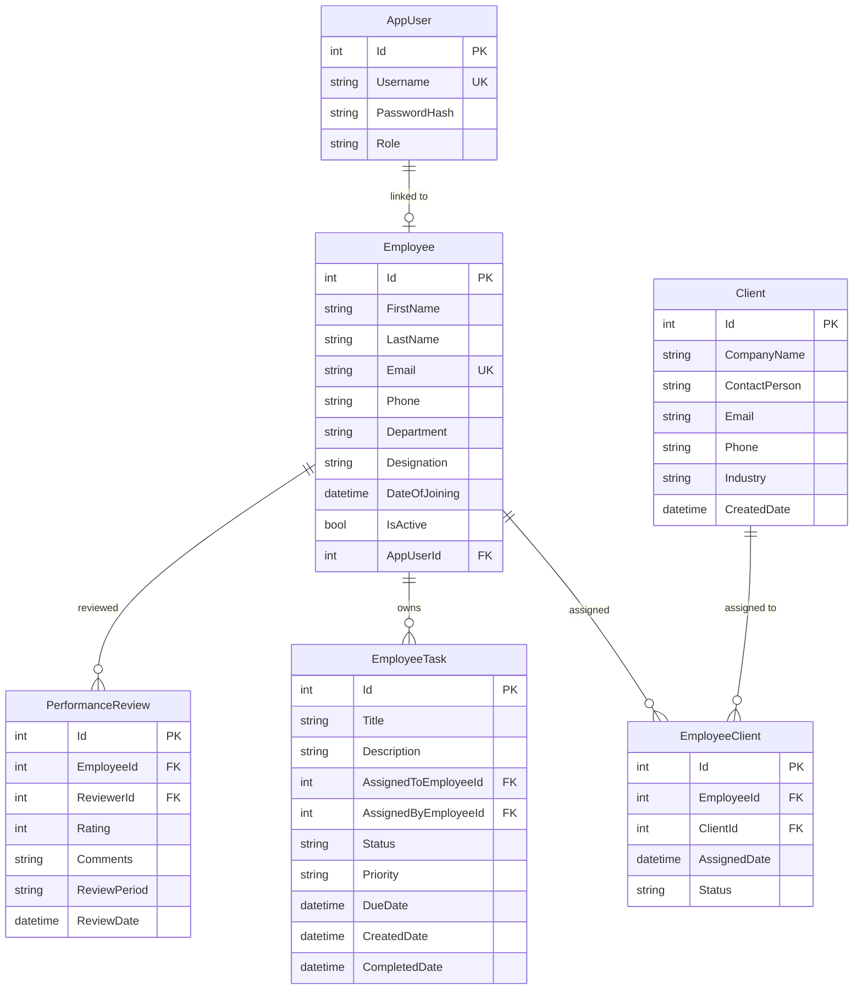

# Multi-Page Employee CRM System — Implementation Plan

## 1. Overview

Build a **multi-page Employee CRM** with two ASP.NET Core projects inside one solution:

| Layer | Project | Role |
|-------|---------|------|
| **Backend API** | `EmployeeCRM.API` | RESTful Web API — all CRUD, business logic, EF Core, SQL Server |
| **Frontend MVC** | `EmployeeCRM.MVC` | Razor views — consumes the API via `HttpClient` |
| **Shared Library** | `EmployeeCRM.Shared` | DTOs, Enums, Constants shared between API & MVC |

> [!IMPORTANT]
> The MVC project **never** touches the database directly. It always calls the Web API. This enforces a clean separation of concerns and demonstrates proper API integration.

---

## 2. User Review Required

> [!WARNING]
> **SQL Server Dependency** — The plan assumes **SQL Server** (LocalDB or full instance) is available on your machine. If you prefer **SQLite** for easier setup (no SQL Server install needed), let me know and I'll adjust.

> [!IMPORTANT]
> **Authentication Scope** — The plan uses ASP.NET Core Identity with cookie-based auth on the MVC side and JWT tokens for the API. For a college project, I can simplify to a lightweight custom auth (username/password stored in DB, no Identity scaffolding) if you prefer.

> [!IMPORTANT]
> **.NET SDK Version** — The plan targets **.NET 8.0**. Confirm you have `dotnet --version` ≥ 8.0 installed.

---

## 3. Solution & Folder Structure

```
c:\Users\niran\Downloads\Pavan Kalyan Project\
│
├── EmployeeCRM.sln
│
├── src/
│   ├── EmployeeCRM.API/              ← Web API project
│   │   ├── Controllers/
│   │   │   ├── AuthController.cs
│   │   │   ├── EmployeesController.cs
│   │   │   ├── ClientsController.cs
│   │   │   ├── TasksController.cs
│   │   │   ├── PerformanceController.cs
│   │   │   └── ReportsController.cs
│   │   ├── Data/
│   │   │   ├── AppDbContext.cs
│   │   │   └── DbInitializer.cs       ← Seed data
│   │   ├── Models/                     ← EF Core entities
│   │   │   ├── Employee.cs
│   │   │   ├── Client.cs
│   │   │   ├── EmployeeTask.cs
│   │   │   ├── PerformanceReview.cs
│   │   │   └── AppUser.cs
│   │   ├── Repositories/
│   │   │   ├── Interfaces/
│   │   │   │   ├── IEmployeeRepository.cs
│   │   │   │   ├── IClientRepository.cs
│   │   │   │   ├── ITaskRepository.cs
│   │   │   │   └── IPerformanceRepository.cs
│   │   │   ├── EmployeeRepository.cs
│   │   │   ├── ClientRepository.cs
│   │   │   ├── TaskRepository.cs
│   │   │   └── PerformanceRepository.cs
│   │   ├── Services/
│   │   │   ├── Interfaces/
│   │   │   │   ├── IEmployeeService.cs
│   │   │   │   ├── IClientService.cs
│   │   │   │   ├── ITaskService.cs
│   │   │   │   ├── IPerformanceService.cs
│   │   │   │   └── IReportService.cs
│   │   │   ├── EmployeeService.cs
│   │   │   ├── ClientService.cs
│   │   │   ├── TaskService.cs
│   │   │   ├── PerformanceService.cs
│   │   │   └── ReportService.cs
│   │   ├── Mappings/
│   │   │   └── MappingProfile.cs       ← AutoMapper or manual mapping
│   │   ├── Migrations/
│   │   ├── Program.cs
│   │   └── appsettings.json
│   │
│   ├── EmployeeCRM.MVC/              ← MVC Frontend project
│   │   ├── Controllers/
│   │   │   ├── HomeController.cs
│   │   │   ├── AccountController.cs
│   │   │   ├── EmployeeController.cs
│   │   │   ├── ClientController.cs
│   │   │   ├── TaskController.cs
│   │   │   ├── PerformanceController.cs
│   │   │   └── ReportController.cs
│   │   ├── Views/
│   │   │   ├── Shared/
│   │   │   │   ├── _Layout.cshtml
│   │   │   │   ├── _LoginPartial.cshtml
│   │   │   │   └── _ValidationScriptsPartial.cshtml
│   │   │   ├── Home/
│   │   │   │   └── Index.cshtml         ← Dashboard
│   │   │   ├── Account/
│   │   │   │   ├── Login.cshtml
│   │   │   │   └── Register.cshtml
│   │   │   ├── Employee/
│   │   │   │   ├── Index.cshtml         ← List + search/filter
│   │   │   │   ├── Create.cshtml
│   │   │   │   ├── Edit.cshtml
│   │   │   │   ├── Details.cshtml
│   │   │   │   └── Delete.cshtml
│   │   │   ├── Client/
│   │   │   │   ├── Index.cshtml
│   │   │   │   ├── Create.cshtml
│   │   │   │   ├── Edit.cshtml
│   │   │   │   └── Details.cshtml
│   │   │   ├── Task/
│   │   │   │   ├── Index.cshtml
│   │   │   │   ├── Create.cshtml
│   │   │   │   ├── Edit.cshtml
│   │   │   │   └── Details.cshtml
│   │   │   ├── Performance/
│   │   │   │   └── Index.cshtml         ← Dashboard cards + charts
│   │   │   └── Report/
│   │   │       └── Index.cshtml
│   │   ├── Services/                    ← HttpClient wrappers
│   │   │   ├── Interfaces/
│   │   │   │   ├── IEmployeeApiService.cs
│   │   │   │   ├── IClientApiService.cs
│   │   │   │   ├── ITaskApiService.cs
│   │   │   │   ├── IPerformanceApiService.cs
│   │   │   │   └── IReportApiService.cs
│   │   │   ├── EmployeeApiService.cs
│   │   │   ├── ClientApiService.cs
│   │   │   ├── TaskApiService.cs
│   │   │   ├── PerformanceApiService.cs
│   │   │   └── ReportApiService.cs
│   │   ├── wwwroot/
│   │   │   ├── css/site.css
│   │   │   ├── js/site.js
│   │   │   └── lib/                     ← Bootstrap 5, jQuery
│   │   ├── Program.cs
│   │   └── appsettings.json
│   │
│   └── EmployeeCRM.Shared/           ← Shared DTOs & Enums
│       ├── DTOs/
│       │   ├── EmployeeDto.cs
│       │   ├── ClientDto.cs
│       │   ├── EmployeeTaskDto.cs
│       │   ├── PerformanceDto.cs
│       │   ├── ReportDto.cs
│       │   ├── LoginDto.cs
│       │   └── RegisterDto.cs
│       └── Enums/
│           ├── TaskStatus.cs
│           └── UserRole.cs
```

---

## 4. Domain Entities & Database Schema

### 4.1 Entity Relationship Diagram



### 4.2 Entity Details

| Entity | Key Fields | Notes |
|--------|-----------|-------|
| `AppUser` | Id, Username, PasswordHash, Role (Admin/Manager/Employee) | Used for authentication |
| `Employee` | Id, FirstName, LastName, Email, Phone, Department, Designation, DateOfJoining, IsActive, AppUserId (FK) | Core entity |
| `Client` | Id, CompanyName, ContactPerson, Email, Phone, Industry, CreatedDate | Managed independently |
| `EmployeeClient` | Id, EmployeeId (FK), ClientId (FK), AssignedDate, Status | Many-to-many link |
| `EmployeeTask` | Id, Title, Description, AssignedToEmployeeId, AssignedByEmployeeId, Status, Priority, DueDate, CreatedDate, CompletedDate | Task tracking |
| `PerformanceReview` | Id, EmployeeId, ReviewerId, Rating (1-5), Comments, ReviewPeriod, ReviewDate | Periodic reviews |

---

## 5. API Endpoints

### 5.1 Auth

| Method | Endpoint | Description |
|--------|----------|-------------|
| POST | `/api/auth/login` | Authenticate user, return JWT token |
| POST | `/api/auth/register` | Register new user (Admin only) |
| GET | `/api/auth/me` | Get current user info |

### 5.2 Employees

| Method | Endpoint | Description |
|--------|----------|-------------|
| GET | `/api/employees` | List all (with search/filter/pagination) |
| GET | `/api/employees/{id}` | Get employee by ID |
| POST | `/api/employees` | Create new employee |
| PUT | `/api/employees/{id}` | Update employee |
| DELETE | `/api/employees/{id}` | Soft-delete employee |
| GET | `/api/employees/{id}/clients` | Get assigned clients |
| GET | `/api/employees/{id}/tasks` | Get assigned tasks |

### 5.3 Clients

| Method | Endpoint | Description |
|--------|----------|-------------|
| GET | `/api/clients` | List all clients |
| GET | `/api/clients/{id}` | Get client by ID |
| POST | `/api/clients` | Create client |
| PUT | `/api/clients/{id}` | Update client |
| DELETE | `/api/clients/{id}` | Delete client |
| POST | `/api/clients/assign` | Assign client to employee |
| GET | `/api/clients/{id}/history` | Get client assignment history |

### 5.4 Tasks

| Method | Endpoint | Description |
|--------|----------|-------------|
| GET | `/api/tasks` | List all tasks (filterable by status/employee) |
| GET | `/api/tasks/{id}` | Get task details |
| POST | `/api/tasks` | Create task |
| PUT | `/api/tasks/{id}` | Update task |
| PATCH | `/api/tasks/{id}/status` | Update task status only |
| DELETE | `/api/tasks/{id}` | Delete task |

### 5.5 Performance

| Method | Endpoint | Description |
|--------|----------|-------------|
| GET | `/api/performance` | List all reviews |
| GET | `/api/performance/employee/{id}` | Get reviews for an employee |
| POST | `/api/performance` | Create review |
| GET | `/api/performance/dashboard` | Aggregated metrics (completed tasks, avg rating, client count) |

### 5.6 Reports

| Method | Endpoint | Description |
|--------|----------|-------------|
| GET | `/api/reports/employee-summary` | Employee summary report |
| GET | `/api/reports/task-summary` | Task completion report |
| GET | `/api/reports/client-engagement` | Client engagement metrics |

---

## 6. MVC Pages (Multi-Page Navigation)

| Page | Route | Description |
|------|-------|-------------|
| **Dashboard** | `/` | Overview cards: total employees, clients, pending tasks, avg performance |
| **Login** | `/Account/Login` | Login form |
| **Register** | `/Account/Register` | Registration (Admin only) |
| **Employee List** | `/Employee` | Searchable, filterable table with pagination |
| **Employee Create** | `/Employee/Create` | Form to add new employee |
| **Employee Edit** | `/Employee/Edit/{id}` | Form to edit employee |
| **Employee Details** | `/Employee/Details/{id}` | View employee with assigned clients & tasks |
| **Employee Delete** | `/Employee/Delete/{id}` | Confirmation page |
| **Client List** | `/Client` | Clients table |
| **Client Create** | `/Client/Create` | Add client form |
| **Client Edit** | `/Client/Edit/{id}` | Edit client form |
| **Client Details** | `/Client/Details/{id}` | View client with assignment history |
| **Task List** | `/Task` | Tasks table with status filter |
| **Task Create** | `/Task/Create` | Assign task form |
| **Task Edit** | `/Task/Edit/{id}` | Edit/update status |
| **Task Details** | `/Task/Details/{id}` | Full task view |
| **Performance Dashboard** | `/Performance` | Charts & metric cards |
| **Reports** | `/Report` | Tabular reports with filters |

---

## 7. Technology & Libraries

| Category | Technology |
|----------|-----------|
| Framework | ASP.NET Core 8.0 |
| ORM | Entity Framework Core 8.0 (Code-First) |
| Database | SQL Server (LocalDB) |
| Data Queries | LINQ |
| Auth | JWT (API) + Cookie Auth (MVC) |
| CSS Framework | Bootstrap 5.3 |
| Charts | Chart.js (for performance dashboard) |
| HTTP Client | `IHttpClientFactory` |
| API Docs | Swagger / Swashbuckle |
| Mapping | Manual DTO mapping (no extra dependency) |
| Validation | Data Annotations + ModelState |

---

## 8. Key Architecture Patterns

### 8.1 Layered Flow (API)

```
Controller → Service → Repository → DbContext (EF Core) → SQL Server
```

- **Controllers**: Thin — only handle HTTP concerns, validation, and delegate to services
- **Services**: Business logic, orchestration, mapping
- **Repositories**: Data access using LINQ queries against EF Core
- **DbContext**: Entity configuration, relationships, migrations

### 8.2 MVC → API Flow

```
MVC Controller → ApiService (HttpClient) → Web API → Service → Repository → DB
```

- MVC controllers inject `IXxxApiService`
- ApiService classes use `IHttpClientFactory` to call the Web API
- JWT token stored in session/cookie, passed as `Authorization: Bearer` header

### 8.3 Dependency Injection

All interfaces registered in `Program.cs`:

```csharp
// API Project
builder.Services.AddScoped<IEmployeeRepository, EmployeeRepository>();
builder.Services.AddScoped<IEmployeeService, EmployeeService>();
// ... etc.

// MVC Project
builder.Services.AddHttpClient<IEmployeeApiService, EmployeeApiService>(client =>
{
    client.BaseAddress = new Uri("https://localhost:7001/api/");
});
```

---

## 9. Authentication & Authorization Design

| Concern | Approach |
|---------|----------|
| Password Storage | Hashed with `BCrypt` |
| API Auth | JWT Bearer tokens |
| MVC Auth | Cookie Authentication (stores JWT in session) |
| Roles | `Admin`, `Manager`, `Employee` |
| Admin | Full access to all modules |
| Manager | Can manage employees, assign tasks/clients, view reports |
| Employee | Can view own profile, tasks, and clients only |

### Role-Based Access Matrix

| Feature | Admin | Manager | Employee |
|---------|-------|---------|----------|
| Manage Employees | ✅ CRUD | ✅ Read + limited edit | ❌ Own profile only |
| Manage Clients | ✅ CRUD | ✅ CRUD | ✅ Read assigned only |
| Manage Tasks | ✅ CRUD | ✅ CRUD | ✅ Update own task status |
| Performance Reviews | ✅ CRUD | ✅ Create + Read | ✅ Read own |
| Reports | ✅ All | ✅ All | ❌ |
| User Registration | ✅ | ❌ | ❌ |

---

## 10. Phased Build Order

### Phase 1 — Foundation (Solution + DB)
1. Create solution and three projects (`API`, `MVC`, `Shared`)
2. Define all entities in `API/Models/`
3. Define all DTOs in `Shared/DTOs/`
4. Configure `AppDbContext` with Fluent API
5. Create initial EF Core migration and seed data
6. **Verify**: Database created, seeded, Swagger loads

### Phase 2 — API CRUD (Employee & Client)
1. Implement Repository + Service + Controller for **Employees**
2. Implement Repository + Service + Controller for **Clients** (including assignment)
3. Add search/filter/pagination to list endpoints
4. **Verify**: All endpoints testable via Swagger

### Phase 3 — API CRUD (Tasks & Performance)
1. Implement Task CRUD + status update endpoint
2. Implement PerformanceReview CRUD + dashboard aggregation
3. Implement Report endpoints
4. **Verify**: Full API surface testable via Swagger

### Phase 4 — Authentication
1. Implement `AppUser` entity and auth endpoints
2. Add JWT middleware to API
3. Add `[Authorize]` attributes with role policies
4. **Verify**: Protected endpoints require valid JWT

### Phase 5 — MVC Frontend (Core Pages)
1. [x] Set up MVC project with Bootstrap 5 layout
2. [x] Build `ApiService` classes with `IHttpClientFactory`
3. [x] Implement Login/Register pages
4. [x] Implement Employee CRUD views
5. [x] Implement Client CRUD views
6. [x] **Verify**: Full employee & client workflows work end-to-end

### Phase 6 — MVC Frontend (Advanced Pages)
1. [x] Implement Task management views
2. [x] Implement Performance dashboard with Chart.js
3. [x] Implement Reports page
4. [x] Build Dashboard (Home/Index) with summary cards
5. [x] Add role-based menu visibility
6. [x] **Verify**: All pages navigate correctly, data flows end-to-end

### Phase 7 — Polish
1. Add validation messages & error handling
2. Add loading states and confirmation dialogs
3. Responsive design testing
4. Final code cleanup

---

## 11. Open Questions

> [!IMPORTANT]
> **1. SQL Server or SQLite?**
> Do you have SQL Server / LocalDB installed? SQLite requires zero setup and is fine for a project demo.

> [!IMPORTANT]
> **2. .NET Version?**
> Please confirm your installed .NET SDK version (`dotnet --version`). This plan targets .NET 8.0.

> [!NOTE]
> **3. Simplified Auth?**
> For a college project, I can use a simpler custom auth instead of full ASP.NET Identity. This reduces complexity significantly. Do you have a preference?

> [!NOTE]
> **4. Seed Data?**
> I'll pre-seed the database with sample employees, clients, and tasks so the app has demo data on first run. Is that acceptable?

---

## 12. Verification Plan

### Automated Tests
```bash
# Build verification
dotnet build EmployeeCRM.sln

# Run the API
dotnet run --project src/EmployeeCRM.API

# Run the MVC app
dotnet run --project src/EmployeeCRM.MVC
```

### Browser Verification
- Verify Swagger UI loads at `https://localhost:7001/swagger`
- Verify MVC app loads at `https://localhost:5001`
- Test complete CRUD workflows for each entity
- Test login/logout flow
- Test role-based access restrictions
- Verify dashboard charts render correctly

### Key Checkpoints
- [ ] Database migrations run successfully
- [ ] All API endpoints return correct responses
- [ ] MVC pages correctly consume API data
- [ ] Authentication flow works end-to-end
- [ ] Role-based authorization enforced
- [ ] Search and filter functionality works
- [ ] Performance dashboard displays metrics
